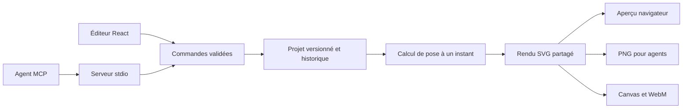

# Architecture v0.2

## Objectif

Un même projet et un même moteur sont utilisés par l’éditeur humain et les agents. Le premier jalon privilégie un parcours complet et reproductible. Le système est un monolithe modulaire dans un dépôt unique ; il n’y a pas de microservices ou de base de données à ce stade.

## Contrats

`schema.ts` définit le schéma Zod, les types TypeScript et les plafonds. Un projet contient des scènes ordonnées ; une scène contient des personnages et des éléments génériques. IDs stables au sein de leur portée, `schemaVersion: 2`, canevas de 16 à 4096 pixels par axe et cadence de 1 à 60 i/s. Les temps des personnages sont relatifs à leur scène ; le rendu du projet reçoit un temps global.

`commands.ts` expose dix commandes. Chaque lot est appliqué à une copie, puis validé entièrement ; une erreur ne modifie pas la source. Le store conserve jusqu’à cent états pour annuler/rétablir. Les mutations exposées par l’éditeur et le MCP passent par ce store. Le MCP ajoute un contrôle de révision pour les mutations de session.

`engine.ts` calcule la scène active et les articulations sans horloge cachée. Les angles des bras et jambes, la bouche et le déplacement se déduisent du temps explicite. Les frontières de scène appartiennent à la scène suivante ; la fin du projet affiche la dernière pose.

`svg.ts` transforme la scène en SVG sans accès au DOM. Les textes sont échappés. Les positions sont validées ; aucune URL de média ni SVG arbitraire n’est accepté. Le même SVG alimente l’interface, le PNG navigateur et le PNG MCP. Les moteurs typographiques natifs peuvent produire de petites différences entre le navigateur et resvg.

## Décisions et compromis

| Choix                     | Motif                                                       | Limite et évolution                                                        |
| ------------------------- | ----------------------------------------------------------- | -------------------------------------------------------------------------- |
| React + TypeScript + Vite | Interface web portable et types partagés                    | Découper l’interface en composants par domaine au prochain jalon           |
| SVG initial               | Rendu inspectable et image statique serveur sans navigateur | Mesurer les performances avant ajout éventuel de PixiJS                    |
| Rig procédural simple     | Permet de vérifier tout le parcours immédiatement           | Introduire os, attaches, contraintes, puis rig editor                      |
| JSON v2                   | Portable, validé et facile à inspecter                      | Migrer vers archive projet + assets lorsque nécessaire                     |
| Stockage navigateur       | Zéro backend pour le premier déploiement                    | Ajouter IndexedDB/autosaves ; pas de partage multi-onglets garanti         |
| MCP stdio                 | Connexion locale sans serveur Internet ouvert               | Serveur distant avec authentification et isolation plus tard               |
| WebM MediaRecorder        | Export accessible sans backend                              | Temps réel, sans audio, cadence non garantie ; rendu image par image futur |

## Sécurité et persistance

L’éditeur ne contient ni clé, ni compte, ni API distante. Les projets importés sont plafonnés à 5 Mo. Les données sont validées ; les textes du projet ne deviennent pas du code.

Le MCP écrit uniquement dans `ANIMATELIER_PROJECTS_DIR` ou `agent-projects` du répertoire courant. Les noms autorisés excluent les séparateurs de chemin. L’écrasement d’un fichier demande `overwrite: true`. L’accès au processus local confère l’accès à cette session et à ce dossier : ne pas l’exposer directement sur Internet. Une session MCP est indépendante des autres sessions et du navigateur. Le contrôle de révision ne verrouille pas les fichiers entre plusieurs processus ; donner des dossiers ou noms distincts aux agents tant qu’un coordinateur partagé n’existe pas.

## Avant de monter en charge

Établir des mesures sur une machine de référence : temps de rendu, mémoire, coût des commandes, performance avec 10 puis 40 personnages. Extraire le rendu lourd dans un worker seulement lorsque les mesures le justifient. Pour le cloud : comptes et autorisation, stockage des ressources, file de jobs idempotents, limites par utilisateur, annulation, reprise et observabilité précèdent le déploiement public du backend.

## Éléments et interpolation — lot 1 v2

Voir [FORMAT-V2.md](FORMAT-V2.md) pour le contrat détaillé et l’exception de compatibilité autorisée par l’utilisateur. `elements.ts` définit cinq types structurés et une validation des arbres limitée avant récursion. `keyframes.ts` valide les pistes et interpole les propriétés ; `element-state.ts` compose leurs matrices de transformation. Le rendu et getStateAt partagent ce calcul.

Les groupes forment des couches indivisibles, leurs enfants sont ordonnés localement. Le renderer échappe le texte et génère lui-même le SVG ; il n’accepte ni balisage arbitraire ni URL de média. L’éditeur propose un panneau de formes et un éditeur d’images clés ; toutes les mutations passent par les commandes du core. Les images clés des personnages sont actuellement éditables par API ; leurs valeurs de base restent dans l’inspecteur.

Les clés localStorage v2 évitent de charger les anciens projets. Les anciens fichiers et données v1 ne sont pas supprimés automatiquement. Aucune migration n’est livrée.

## Compilation de quiz

`packages/core/quiz.ts` valide un script haut niveau puis produit des scènes v2 avec des éléments, pistes et personnages existants. Aucun nouveau type de rendu ni changement de schéma du projet. Les modes `choices`, `list`, `cards` et `levels` partagent le même point d’entrée ; les layouts et thèmes sont des compilateurs de présentation, pas des types persistants. Compilation pure, ID stable `quiz_compiled`, calendrier global ; `loadQuiz` côté navigateur attribue un nouvel ID avant le chargement validé dans le store. Le MCP expose la même compilation sans mutation, puis utilise son chargement avec révision habituel. Les scripts ne sont pas stockés dans le projet produit : l’éditeur modifie les primitives et personnages produits, pas une référence au script.

## Pistes et attaches — lot personnages

Champs v2 additifs : actor.timeline, wobble et element.attachment. `poseAt` évalue action, dialogue et déplacement à un temps donné. `rig.ts` partage les matrices du corps et des mains avec le renderer. `scene-state.ts` compose les éléments racines attachés et leurs enfants avec les mêmes matrices pour SVG et inspection. La validation de scène rejette les attaches imbriquées ou les personnages absents. Aucun accès DOM dans ces modules. Contrat complet : [PERSONNAGES.md](PERSONNAGES.md), repris dans l’aide intégrée et vérifié par test.

## Rendu hors navigateur

`packages/headless` dépend du core et du renderer ; il ajoute resvg, worker_threads et ffmpeg. CLI et MCP utilisent le même encodeur. Core conserve les métriques typographiques pures ; renderer produit le SVG déterministe. Polices embarquées, images calculées à f/fps, ordre conservé sous contre-pression, publication atomique de la vidéo achevée. Voir [HEADLESS.md](HEADLESS.md).

## Images et stockage — 21 septembre 2026

Core valide l’enveloppe des assets, signatures/dimensions et SHA-256 portable ; les adaptateurs headless (Sharp) et navigateur décodent réellement les images avant chargement/rendu. Renderer n’accepte que des data-URI générées à partir des assets validés. Les fichiers locaux restent confinés au dossier d’assets. Les pixels de mosaïque sont des données dérivées, sans URL externe. IndexedDB stocke les images, localStorage les références ; JSON exportés autonomes. Voir QUIZ-VIDEO.md pour plafonds et conventions. Temps locaux normalisés à1ns afin de stabiliser les frontières de scènes et de révélation.
